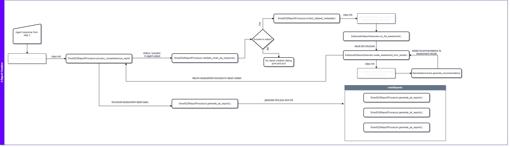

# LLM Data Quality Tool

## What This Project Does

This project helps check data quality in databases with using simple English questions in other words with NLP. Instead of writing complex SQL queries, questions like "check for duplicates in staging customer data" or "find missing values in prod sales table" can be asked and the codebase will understand the request, perform the analysis and create reports in different formats. In cases like a comprehensive report generation needed for all defined data quality methods codebase can create a complete report for queries like "create a comprehensive data quality report for snowflake`s production customers table".

## What It Can Do

- **Questions in Plain English**: Normal questions about data can be typed like "check prod customer table for duplicates" or "check snowflake customer data for quality issues"
- **Automatic Table Finding**: The system finds the right tables when environment (staging/prod) or database type are specified within query. Users should only define target database in settings.yaml or .env not schema because there is a capability to scan all schemas under defined database and find correct tables by relevance score.
- **Data Quality Checking**: Duplicates, missing values, and statistics are identified
- **Multiple Database Support**: Snowflake and PostgreSQL databases are supported and can be extended by design
- **Report Creation**: Reports are generated in different formats (html, json files for downstream usage, markdown files)
- **Reliable Results**: Accurate data is obtained directly from databases

## How the Data Quality Tool Works

The data quality tool works in 3 simple steps to check your data quality:

### Step 1: Database Indexing
First, the database is scanned to learn about all tables and columns. A searchable index of database tables is created using table metadata (table names, column names, data types, sample data) and this information is stored in a vector database called ChromaDB. This happens once and helps the tool quickly find the right tables when questions are asked. Whenever source schema changes related functions should be run update vector database. This process decoupled from smart analysis part in order to avoid scanning database everytime user queried.

**What happens**: Database tables → Scanned and indexed → Stored in searchable format

**Flow Diagram**: diagrams/llm_dq_diagram_indexing_draw

**Detailed Process**: See [schema_indexing_process.md](docs/schema_indexing_process.md) for complete technical details

### Step 2: Smart Analysis
When a question like "check customer data quality in production database" is asked, the data quality tool uses AI to:
- Find the best matching tables from the index created in Step 1
- Choose the right data quality checks (duplicates, missing values, statistics)
- Run the analysis on the actual database
- Use RAG (search + AI) to understand the question and pick the correct actions

**What happens**: Question → AI finds right tables → Runs data quality checks → Gets results

**Flow Diagram**: diagrams/llm_dq_diagram_smart_dq_draw

**Detailed Process**: See [smart_dq_check_process.md](docs/smart_dq_check_process.md) for complete AI workflow details

### Step 3: Report Creation
Finally, all the analysis results are taken and easy-to-read reports are created in three different formats:
- **`.md` files** - Text reports that can be read and shared
- **`.html` files** - Web pages that can be opened in browsers
- **`.json` files** - Data files that other programs can use

All reports are saved in the `/reports` folder with timestamps in the filename so each analysis can be tracked when it was done.

**What happens**: Analysis results → Formatted into reports → Saved as .md, .html, .json files

**Flow Diagram**: diagrams/llm_dq_diagram_reporting_draw

**Detailed Process**: See [report_creation_process.md](docs/report_creation_process.md) for complete report generation details

## Project Files and Folders

### `/src` - Main Code
This folder contains all the important code that makes the system work:

#### `/agent`
- **`smart_planner.py`** - Main file that handles questions and runs analysis
- **`reporting_tools.py`** - Helper tools for generating and processing reports

#### `/connectors`
- **`base_connector.py`** - Basic template for connecting to databases
- **`connector_factory.py`** - Chooses the right database connector based on setup configuration
- **`snowflake_connector.py`** - Connects to Snowflake databases
- **`postgres_connector.py`** - Connects to PostgreSQL databases
- **`schema_discovery.py`** - Discovers and analyzes database schemas

#### `/data_quality`
- **`checks.py`** - Functions that actually check data (finds duplicates, missing values, stats)

#### `/retrieval`
- **`schema_indexer.py`** - Builds a searchable database of tables so the system can find them

#### `/reporting`
- **`report_generator.py`** - Makes reports in different formats, contains the main `run_full_assessment` function
- **`report_processor.py`** - Processes results and handles the final report creation
- **`report_templates.py`** - Templates for creating nice-looking reports
- **`remediation_advisor.py`** - Provides suggestions on how to fix data quality problems

### `/config` - Settings
Files that control how the system works:

- **`settings.yaml`** - Main settings file with database connections and system options
- **`.env.example`** - Example file showing what passwords and API keys are needed

### `/docs` - Documentation
Detailed explanations of how everything works:

- **`report_creation_process.md`** - Explains how reports are made step by step
- **`schema_indexing_process.md`** - Explains how the data quality tool builds a searchable table database
- **`smart_dq_check_process.md`** - Explains how the AI agent understands questions and picks the right actions
- **`smart_dq_check_workflow.md`** - Additional workflow documentation
- **`indexing_flow_diagram.md`** - Visual flow diagrams for the indexing process

### `/notebooks` - Testing and Examples
Jupyter notebook files for testing and experimentation:

- **`tryouts.ipynb`** - Main testing file where the system can be tried and examples can be seen

### `/data` - Sample Data
Sample data files for testing and demonstration:

- **`fake_customers_*.csv`** - Sample customer data files for testing
- **`fake_invoices_*.csv`** - Sample invoice data files for testing
- **`fake_products_*.csv`** - Sample product data files for testing
- **`fake_sales_*.csv`** - Sample sales data files for testing
- **`fake_data_generator.py`** - Script to generate synthetic test data

### `/chroma_db` - Search Database
Database files that help the system find tables:

- **`chroma.sqlite3`** - Database file containing information about tables for quick searching
- **`schema_fingerprint_*.json`** - Schema fingerprint files for different database types
- **`schema_cache_*.json`** - Cached schema information for faster retrieval
- **Various UUID folders** - Collections of table information organized by database type

### `/reports` - Generated Reports
Folder where data quality reports are saved:

- **`comprehensive_dq_report_*.md`** - Text reports that can be read
- **`comprehensive_dq_report_*.html`** - Web page reports that can be opened in browsers
- **`comprehensive_dq_report_*.json`** - Data files that other programs can read

### Root Files
- **`README.md`** - This file explaining the project
- **`pyproject.toml`** - Python project settings and required packages
- **`poetry.lock`** - Locked dependency versions for reproducible installs
- **`.gitignore`** - Tells Git which files to ignore
- **`.env`** - Private settings file (passwords, API keys - not shared)
- **`.env.example`** - Example environment file showing required variables

## How to Get Started

1. **Set up settings**: Copy `.env.example` to `.env` and add database passwords and API keys
2. **Configure data sources**: The `config/settings.yaml` file is set up for Snowflake and PostgreSQL by default. To work with different data sources, this file needs to be updated with specific database configurations
3. **Install required packages**: Run `poetry install` (or `pip install -e .` if not using Poetry)
4. **Build table search database**: Run `python src/retrieval/schema_indexer.py` to let the system learn about tables
5. **Start using it**: Open `notebooks/tryouts.ipynb` to try it out or use the code directly

## How to Ask Questions

For best results, these details can be included in questions:
Even though those are not added in queries relevance score by semantic similarity will be taken into so below items are not mandatory.
Relevance score calculation based on table description, column details, sample data, row counts will get better score.
For this POC, staging database defined as postgre on local while snowflake defined as prod database and data flaws are less in prod.

### Database Environment
Optional ! The database environment to be checked can be specified:
- **Staging**: "check staging customer table for duplicates"
- **Production**: "analyze prod sales data quality"
- **Development**: "find missing values in dev user table"

### Database Type
Optional ! The database system being used can be mentioned (not mandatory, can help increase relevance score in RAG process):
- **Snowflake**: "check snowflake customer data for quality issues"
- **PostgreSQL**: "analyze postgres analytics table for duplicates"

### Complete Examples
- "Generate comprehensive DQ report for staging sales table in postgres"
- "Check prod customers table for missing values"
- "Analyze staging analytics data quality"
- "Find duplicates in production invoice table snowflake"

**Why This Helps**: The system can automatically connect to the right database and find the correct tables faster by the help of RAG process when the environment (staging/prod) and database type (snowflake/postgres) are specified in the question. They are adding booster in relevance scores.

## Technology Used

- **Python** - Main programming language
- **LangChain** - Handles the AI agent that understands questions
- **OpenAI** - The AI GPT used in reasoning and report return
- **Pandas** - Handles data analysis and statistics on data gathered from target databases
- **ChromaDB** - Stores table information for quick searching
- **Snowflake & PostgreSQL** - Supported database types
- **Jupyter Notebooks** - For interactive testing and examples

This project makes data quality checking easy by allowing questions to be asked in normal English instead of writing complex database queries.
