# Smart DQ Check Workflow Documentation

## Smart DQ Check Process Overview

### Query Processing and Initialization
The process begins when the `run_smart_dq_check` method receives a natural language query (e.g., "check invoice data quality"). The system initializes the workflow by creating a SchemaIndexer instance through `get_schema_aware_retriever`, which prepares the foundation for intelligent table discovery using the pre-built ChromaDB vector index.

### Semantic Table Discovery (RAG Implementation)
The system leverages the existing vector index to find relevant tables through the `search_tables` method. **This is where RAG (Retrieval-Augmented Generation) is applied:**

**RAG Components:**
• **Retrieval Phase**: Converting the user query into a 384-dimensional vector using HuggingFace embeddings (all-MiniLM-L6-v2 model)
• **Vector Search**: Performing cosine similarity search against the ChromaDB collection containing indexed table metadata
• **Augmentation Phase**: Formatting retrieved table metadata into rich context for LLM agent consumption
• **Generation Phase**: LLM agent uses augmented table context to make intelligent tool and table selection decisions

**Technical Implementation:**
• Database preference detection logic to boost tables from preferred connectors (Snowflake vs PostgreSQL)
• Ranking discovered tables by relevance scores with database-specific boosting algorithms
• Context formatting: Retrieved tables structured as detailed prompts with metadata, column info, and relevance scores

## RAG Application in Smart DQ Check

### Where RAG is Applied
**File**: `src/retrieval/schema_indexer.py`
**Method**: `search_tables(query, top_k=3)` → Line 288

### RAG Components Breakdown

#### 1. **Retrieval Phase** (The "R" in RAG)
```python
# Vector similarity search against pre-built index
query_embedding = self.embeddings.embed_query(query)  # Convert query to 384-dim vector
results = collection.query(                            # Search ChromaDB vector store
    query_embeddings=[query_embedding],
    n_results=search_limit,
    include=['documents', 'metadatas', 'distances']
)
```

**What's Retrieved**:
- Table metadata documents (table names, column definitions, data types, row counts)
- Similarity scores based on semantic matching
- Database connector information

#### 2. **Augmentation Phase** (The "A" in RAG)
The retrieved table information is formatted and augmented into a rich context:

```python
# Example augmented context passed to the LLM agent:
tables_context = """RELEVANT TABLES (ranked by relevance):

--- Table #1 ---
Connector Type: SNOWFLAKE
Full Name: PROD_SALES.PUBLIC.INVOICES
Relevance: 85.23%
Metadata:
Table: INVOICES
Columns: invoice_id (NUMBER), customer_id (NUMBER), invoice_date (DATE),
         amount (DECIMAL), status (VARCHAR), created_at (TIMESTAMP)
Row Count: 1,250,000
Sample Data:
  invoice_id | customer_id | amount  | status
  1001       | 501         | 1250.00 | PAID
  1002       | 502         | 750.50  | PENDING
"""
```

#### 3. **Generation Phase** (The "G" in RAG)
**File**: `src/agent/smart_planner.py` → `agent.invoke()`

The LLM agent receives the augmented context and generates:
- Tool selection decisions
- Table selection from retrieved candidates
- Data quality analysis execution

### RAG Flow in Context

```mermaid
flowchart LR
    A[User Query: "check invoice data quality"] --> B[Vector Embedding]
    B --> C[ChromaDB Vector Search]
    C --> D[Retrieve Relevant Tables]
    D --> E[Augment with Rich Context]
    E --> F[LLM Agent Generation]
    F --> G[Execute DQ Analysis]

    style C fill:#e8f5e8
    style D fill:#e8f5e8
    style E fill:#fff3e0
    style F fill:#e1f5fe
```

### Key RAG Implementation Details

1. **Vector Store**: ChromaDB with HuggingFace embeddings (all-MiniLM-L6-v2)
2. **Indexed Documents**: Table schema metadata converted to rich text descriptions
3. **Retrieval Strategy**: Cosine similarity search with database preference boosting
4. **Context Integration**: Retrieved tables formatted as structured prompt context for the LLM
5. **Generation Output**: Intelligent tool and table selection for data quality analysis

### Why RAG is Essential Here

- **Semantic Understanding**: Finds relevant tables even with different terminology (e.g., "invoice" query finds "billing" tables)
- **Scale Handling**: Efficiently searches through hundreds/thousands of tables
- **Context-Aware**: Provides rich table metadata to help LLM make informed decisions
- **Dynamic Discovery**: No need to pre-define which tables are relevant for each query

The RAG implementation enables the system to intelligently discover relevant tables from natural language queries, which is the foundation that makes the entire Smart DQ Check workflow possible.

### AI Agent Creation and Tool Registration
The `create_smart_dq_agent` method establishes an intelligent LLM-powered agent using LangChain's framework. This involves:
• Direct import of data quality tools from the DQ_TOOLS collection
• Wrapping each DQ function (duplicates, nulls, descriptive stats) as structured LangChain tools via `create_dq_tool_wrapper`
• Configuring a ChatOpenAI instance with specific model parameters and API credentials
• Creating an AgentExecutor with comprehensive system prompts that define keyword-based tool selection logic

**Agent Creation Code:**
```python
def create_smart_dq_agent():
    # Convert all DQ functions to tools supporting multiple connectors
    dq_tools = []

    # Add individual DQ check tools
    for dq_function in DQ_TOOLS:
        wrapper_func = create_dq_tool_wrapper(dq_function)

        # Create tool description based on function name
        if 'duplicate' in dq_function.__name__:
            description = """Check for duplicate rows in a database table.
            Args:
                dataset_id: Full table name (e.g., 'DATABASE.SCHEMA.TABLE')
                connector_type: Database type - 'snowflake' or 'postgres'
            """
        elif 'null' in dq_function.__name__:
            description = """Analyze null values and missing data in a database table.
            Args:
                dataset_id: Full table name (e.g., 'DATABASE.SCHEMA.TABLE')
                connector_type: Database type - 'snowflake' or 'postgres'
            """
        else:
            description = f"""Execute data quality check: {dq_function.__name__}
            Args:
                dataset_id: Full table name (e.g., 'DATABASE.SCHEMA.TABLE')
                connector_type: Database type - 'snowflake' or 'postgres'
            """

        tool = StructuredTool.from_function(
            func=wrapper_func,
            name=dq_function.__name__,
            description=description
        )
        dq_tools.append(tool)

    # Initialize LLM with specific configuration
    llm = ChatOpenAI(
        temperature=0,
        model="gpt-4o",
        openai_api_key=os.getenv("OPENAI_API_KEY"),
        openai_api_base=os.getenv("OPENAI_BASE_URL")
    )

    # Create agent with system prompt
    agent = create_tool_calling_agent(llm, dq_tools, prompt)
    executor = AgentExecutor(agent=agent, tools=dq_tools, verbose=True)

    return executor
```

**System Prompt Configuration:**
```python
prompt = ChatPromptTemplate.from_messages([
    ("system", """You are an expert Data Quality Agent with access to multiple database systems.

    Your task:
    1. Understand the user's data quality request
    2. Identify the TYPE OF REQUEST:
       - For "duplicates" → use check_dataset_duplicates
       - For "null values" → use check_dataset_null_values
       - For "statistics" → use check_dataset_descriptive_stats
       - For "report" → use generate_comprehensive_dq_report
    3. Select the most appropriate table from provided options
    4. Call function with BOTH dataset_id AND connector_type"""),
    MessagesPlaceholder(variable_name="chat_history"),
    ("human", "{input}"),
    MessagesPlaceholder(variable_name="agent_scratchpad"),
])
```

### Intelligent Tool Selection
The LLM agent analyzes the user query and table context to select the appropriate data quality tool. The system uses keyword mapping logic defined in the system prompt:
• "duplicates" keywords → `check_dataset_duplicates`
• "null values" or "missing data" → `check_dataset_null_values`
• "statistics" or "descriptive stats" → `check_dataset_descriptive_stats`
• "report" keywords → `generate_comprehensive_dq_report`
The agent's GPT-4 intelligence allows flexible understanding beyond exact keyword matching.

### Database Connection Management
Upon tool selection, the system establishes database connectivity through the ConnectorFactory pattern. The `create_connector` method:
• Loads base configuration from settings.yaml with default values
• Applies environment variable overrides from .env files following a strict hierarchy (defaults < yaml < env vars)
• Creates the appropriate connector instance (SnowflakeConnector or PostgresConnector) with proper authentication
• Implements context manager protocols for automatic connection cleanup and resource management

### Data Quality Analysis Execution
The selected data quality tool executes comprehensive analysis using a hybrid SQL+Pandas approach:
• **SQL Phase**: Executes `SELECT * FROM {table}` queries to load complete datasets via database cursors
• **Pandas Phase**: Converts query results into DataFrames for in-memory analysis operations
• **Error Handling**: Returns empty DataFrames (not dummy data) when connection failures occur to avoid misleading results
• **Analysis Operations**: Performs tool-specific operations like duplicate detection (`df.drop_duplicates()`), null analysis (`df.isnull().sum()`), or statistical summaries (`df.describe()`)

### Results Aggregation and Response
The agent processes analysis results and formats comprehensive responses containing:
• Quality metrics with absolute counts and percentages
• Issue identification with severity categorization
• Actionable recommendations for data quality improvements
• Status indicators and error information when applicable
All results are returned through the AgentExecutor with structured JSON formatting for consistent API responses.

## Overview

The `run_smart_dq_check` process allows users to check data quality using natural language queries like "check invoice data quality". The system automatically finds relevant tables and performs quality analysis.

## Simple Workflow Steps

### Step 1: User Input
**What happens**: User provides a natural language query
**Example**: "check invoice data quality"
**Called from**: User code or examples
**File**: `src/agent/smart_planner.py`
**Method**: `run_smart_dq_check(query: str)` → Line 150
**Code**: `result = run_smart_dq_check("check invoice data quality")`

### Step 2: Find Relevant Tables
**What happens**: System searches for tables matching the query
**Called from**: `run_smart_dq_check()` → Line 173 in `smart_planner.py`
**File**: `src/retrieval/schema_indexer.py`
**Method**: `search_tables(query, top_k=3)` → Line 288
**Code**: `relevant_tables = schema_indexer.search_tables(query, top_k=top_k_tables)`
**Output**: List of relevant tables with scores

### Step 3: Create AI Agent & Register Tools
**What happens**: Sets up LLM agent and registers DQ tools for agent access
**Called from**: `run_smart_dq_check()` → Line 207 in `smart_planner.py`
**File**: `src/agent/smart_planner.py`
**Method**: `create_smart_dq_agent()` → Line 39
**Code**: `agent = create_smart_dq_agent()`
**Tool Registration Process**:
1. **Direct Import**: `from src.data_quality.checks import DQ_TOOLS`
2. **Tool List**: `DQ_TOOLS = [check_dataset_duplicates, check_dataset_null_values, ...]`
3. **Wrap Functions**: Convert to LangChain StructuredTools via `create_dq_tool_wrapper()`
4. **Register with Agent**: Tools added to AgentExecutor's tool registry
5. **Agent Selection**: LLM selects tools based on query keywords (no embedding/vector search)

**Note**: Tools are **NOT embedded/indexed** in vector database - they are directly imported and registered
**Tools Available**:
- check_dataset_duplicates
- check_dataset_null_values
- check_dataset_descriptive_stats
- generate_comprehensive_dq_report

### Step 4: Agent Selects Tool
**What happens**: AI agent analyzes query and picks appropriate tool based on keyword matching
**Called from**: `agent.invoke()` → Line 209 in `smart_planner.py`
**File**: LangChain AgentExecutor (External library)
**Method**: Agent decision logic based on system prompt keyword mapping
**Code**: `result = agent.invoke({"input": full_input, "chat_history": []})`
**Keyword-Based Tool Selection Logic**:
- **"duplicates"**, "duplicate rows", "duplicate records" → `check_dataset_duplicates`
- **"null values"**, "missing data", "nulls", "missing values" → `check_dataset_null_values`
- **"descriptive stats"**, "statistics", "data summary" → `check_dataset_descriptive_stats`
  - *Also understands*: "stats", "summary", "describe data", "column stats", "basic stats", "data analysis", "statistical analysis"
- **"comprehensive report"**, "full report", "assessment report", "generate report" → `generate_comprehensive_dq_report`
- **"save report"**, "export report", "create files" → `save_dq_report_to_file`

**System Prompt Instructions**: Agent uses keyword mappings in system prompt with LLM intent understanding (flexible beyond exact matches)

### Step 5: Connect to Database
**What happens**: Creates connection to appropriate database
**Called from**: DQ tool functions (e.g., `check_dataset_duplicates`) in `checks.py`
**File**: `src/connectors/connector_factory.py`
**Method**: `create_connector(connector_type)` → Line 24
**Code**: `connector = ConnectorFactory.create_connector(connector_type)`
**Supports**: Snowflake, PostgreSQL

### Step 6: Run Data Quality Check
**What happens**: Executes SQL queries to load data, then uses pandas for analysis
**Called from**: Agent-selected DQ functions (e.g., `check_dataset_duplicates`) in `checks.py`
**File**: `src/data_quality/checks.py`
**Method**: Various DQ check functions
**Code**: `df = connector.load_data(dataset_id)` → `cursor.execute(sql_query)`
**Process**:
1. **SQL Execution**: `SELECT * FROM {table}` via database connectors
2. **Data Loading**: Results loaded into pandas DataFrame
3. **Analysis**: Pandas operations for duplicate detection, null analysis, statistics
**Examples**:
- Load data: `SELECT * FROM table` → pandas DataFrame
- Check duplicates: `df.drop_duplicates()` and `len(df)` comparison
- Find nulls: `df.isnull().sum()` on loaded DataFrame
- Get stats: `df.describe()` and `df.dtypes` analysis

### Step 7: Return Results
**What happens**: Formats and displays results to user
**Called from**: `run_smart_dq_check()` → Line 212 in `smart_planner.py`
**File**: `src/agent/smart_planner.py`
**Method**: `agent.invoke()` result processing
**Code**: `return result`
**Output**: JSON with quality metrics, issues found, recommendations

## Detailed Method Call Flow

### run_smart_dq_check() → Method Chain
**File**: `src/agent/smart_planner.py:150`

```python
def run_smart_dq_check(query: str, top_k_tables: int = 3):
    # Step 1: Initialize schema retriever
    schema_indexer = get_schema_aware_retriever()        # → Line 20
        └── return SchemaIndexer()                       # → schema_indexer.py:23

    # Step 2: Search for relevant tables
    relevant_tables = schema_indexer.search_tables(query, top_k=top_k_tables)  # → Line 288
        └── schema_indexer._get_database_mappings()      # → Line 243
        └── HuggingFaceEmbeddings.embed_query()          # External library
        └── chromadb.query()                             # External library

    # Step 3: Create and execute agent
    agent = create_smart_dq_agent()                      # → Line 39
        └── create_dq_tool_wrapper()                     # → Line 25 (for each DQ tool)
        └── ChatOpenAI()                                 # External library
        └── create_tool_calling_agent()                  # External library

    # Step 4: Agent processes and selects tools
    result = agent.invoke({"input": full_input, "chat_history": []})
        └── Agent decides on tool (duplicates/nulls/stats/report)
        └── Tool calls ConnectorFactory.create_connector() # → connector_factory.py:24
        └── Tool executes DQ check functions              # → checks.py
```

### search_tables() → Internal Method Chain
**File**: `src/retrieval/schema_indexer.py:288`

```python
def search_tables(self, query: str, top_k: int = 3):
    # Get database mappings from indexed metadata
    database_mappings = self._get_database_mappings()   # → Line 243
        └── chromadb.get_collection()                   # External library
        └── collection.get(include=['metadatas'])        # External library

    # Hardcoded database detection logic
    if 'postgres' in query.lower():
        preferred_connector = 'postgres'
    elif 'snowflake' in query.lower():
        preferred_connector = 'snowflake'

    # Vector similarity search
    query_embedding = self.embeddings.embed_query(query)  # External library
    results = collection.query(                            # External library
        query_embeddings=[query_embedding],
        n_results=search_limit
    )
```

### create_smart_dq_agent() → Tool Setup Chain
**File**: `src/agent/smart_planner.py:39`

```python
def create_smart_dq_agent():
    # Wrap each DQ function as a tool
    for dq_function in DQ_TOOLS:                        # From checks.py
        wrapper_func = create_dq_tool_wrapper(dq_function)  # → Line 25
            └── def wrapper(dataset_id, connector_type):
                    return dq_function(dataset_id, connector_type=connector_type)

    # Initialize LLM and create agent
    llm = ChatOpenAI()                                   # External library
    agent = create_tool_calling_agent(llm, dq_tools, prompt)  # External library
```

### DQ Tool Execution → Database Chain
**File**: `src/data_quality/checks.py` (Example: check_dataset_duplicates)

```python
def check_dataset_duplicates(dataset_id: str, connector_type: str):
    # Create database connector
    connector = ConnectorFactory.create_connector(connector_type)  # → connector_factory.py:24
        └── ConnectorFactory._load_config(connector_type)          # → Line 54
            └── yaml.safe_load()                                   # Load settings.yaml
            └── os.getenv()                                        # Override with .env vars

    # Execute within context manager
    with connector:                                      # → BaseConnector.__enter__()
        └── snowflake.connector.connect() OR psycopg2.connect()

        # Load data using SQL query
        df = connector.load_data(dataset_id)             # SQL execution
            └── cursor.execute("SELECT * FROM table")          # Load full table
            └── pd.DataFrame(data, columns=columns)           # Convert to pandas

        # Pandas analysis
        total_rows = len(df)
        duplicate_qty = total_rows - len(df.drop_duplicates())
```

## Quick Reference

| Component | File:Line | Purpose |
|-----------|-----------|--------|
| `run_smart_dq_check` | `smart_planner.py:150` | Main entry point |
| `search_tables` | `schema_indexer.py:288` | Find relevant tables |
| `create_smart_dq_agent` | `smart_planner.py:39` | Setup AI agent |
| `create_connector` | `connector_factory.py:24` | Database connection |
| DQ Tools | `checks.py` | Data quality analysis |

## Configuration

**Settings File**: `config/settings.yaml`
```yaml
connectors:
  snowflake:
    discovery:
      database: PROD_SALES
  postgres:
    discovery:
      database: stage_sales
```

**Environment Variables**: `.env`
```bash
SNOWFLAKE_ACCOUNT=xyz.snowflakecomputing.com
SNOWFLAKE_USER=username
SNOWFLAKE_PASSWORD=password

POSTGRES_HOST=localhost
POSTGRES_USER=username
POSTGRES_PASSWORD=password
```

## Example Usage

```python
# Check for duplicates
result = run_smart_dq_check("find duplicate invoice records")

# Analyze null values
result = run_smart_dq_check("check for missing customer data")

# Get statistics
result = run_smart_dq_check("analyze sales amount statistics")

# Generate full report
result = run_smart_dq_check("create comprehensive quality report for orders")
```

## Complete Method Flow with Implementation Details

### 1. Entry Point
**File**: `src/agent/smart_planner.py`
**Method**: `run_smart_dq_check(query: str, top_k_tables: int = 3)` → Line 150

**Parameters**:
- `query` (str): Natural language query like "check invoice data quality"
- `top_k_tables` (int): Maximum number of relevant tables to discover (default: 3)

**Implementation Details**:
```python
def run_smart_dq_check(query: str, top_k_tables: int = 3):
    print(f"\n{'='*70}")
    print("SMART DATA QUALITY CHECK")
    print(f"{'='*70}")
    print(f"User Query: {query}\n")

    # Step 1: Find relevant tables using RAG
    print("Step 1: Discovering relevant tables...")
    print("-" * 70)

    schema_indexer = get_schema_aware_retriever()
    relevant_tables = schema_indexer.search_tables(query, top_k=top_k_tables)
```

**Returns**: Dict with keys:
- `output` (str): Agent's formatted response
- `intermediate_steps` (list): Execution trace
- `input` (str): Original query

**Error Handling**: Returns error message if no tables found or schema index missing

### 2. Table Discovery Phase
**File**: `src/agent/smart_planner.py`
**Method**: `get_schema_aware_retriever()` → Line 20 → Returns `SchemaIndexer()`

**Implementation**:
```python
def get_schema_aware_retriever():
    """Initialize schema discovery for finding relevant tables."""
    return SchemaIndexer()
```

**File**: `src/retrieval/schema_indexer.py`
**Method**: `SchemaIndexer.search_tables(query: str, top_k: int = 3)` → Line 288

**Parameters**:
- `query` (str): User's natural language query
- `top_k` (int): Number of relevant tables to return

**Detailed Implementation Flow**:
```python
def search_tables(self, query: str, top_k: int = 3) -> List[dict]:
    # Step 1: Get dynamic database mappings from indexed metadata
    database_mappings = self._get_database_mappings()

    # Step 2: Detect database preference from query
    preferred_connector = None
    query_lower = query.lower()

    # Step 3: Hardcoded database detection logic
    if any(db in query_lower for db in ['postgres', 'postgresql']):
        preferred_connector = 'postgres'
    elif any(db in query_lower for db in ['snowflake']):
        preferred_connector = 'snowflake'
    else:
        # Fallback to database_mappings lookup
        query_words = query_lower.replace('_', ' ').split()
        for word in query_words:
            if word in database_mappings:
                preferred_connector = database_mappings[word]
                break

    # Step 4: Perform vector similarity search
    query_embedding = self.embeddings.embed_query(query)
    search_limit = max(top_k * 2, 6)
    results = collection.query(
        query_embeddings=[query_embedding],
        n_results=search_limit,
        include=['documents', 'metadatas', 'distances']
    )

    # Step 5: Apply relevance boosting and ranking
    relevant_tables = []
    for i, (doc, metadata, distance) in enumerate(zip(...)):
        base_relevance = 1 - distance
        boosted_relevance = base_relevance

        # Apply database preference boost
        if preferred_connector and metadata['connector_type'] == preferred_connector:
            boosted_relevance = min(base_relevance + 0.3, 1.0)
```

**Returns**: List[dict] with structure:
```python
[
    {
        'rank': 1,
        'table_name': 'INVOICES',
        'full_name': 'PROD_SALES.PUBLIC.INVOICES',
        'metadata': 'Table: INVOICES\nColumns: invoice_id, customer_id, amount...',
        'relevance_score': 0.85,
        'connector_type': 'snowflake',
        'original_relevance': 0.55,
        'boosted': True,
        'table_boost': 0.2,
        'detected_db': 'snowflake',
        'db_mappings_used': {'prod': 'snowflake', 'sales': 'snowflake'}
    }
]
```

#### 2.1 Database Mapping Extraction
**File**: `src/retrieval/schema_indexer.py`
**Method**: `SchemaIndexer._get_database_mappings()` → Line 243

**Detailed Implementation**:
```python
def _get_database_mappings(self) -> dict:
    mappings = {}
    client = chromadb.PersistentClient(path=SCHEMA_VECTOR_DB_PATH)

    try:
        collection = client.get_collection(SCHEMA_COLLECTION_NAME)
        all_results = collection.get(include=['metadatas'])

        if all_results['metadatas']:
            for metadata in all_results['metadatas']:
                full_name = metadata.get('full_name', '')
                connector_type = metadata.get('connector_type', '')

                if connector_type and full_name:
                    # For PostgreSQL: database.schema.table
                    # For Snowflake: DATABASE.SCHEMA.TABLE
                    parts = full_name.split('.')
                    if len(parts) >= 2:
                        database_name = parts[0]
                        mappings[database_name.lower()] = connector_type

                        # Also map words in database name
                        db_words = database_name.lower().replace('_', ' ').split()
                        for word in db_words:
                            if len(word) >= 3:
                                mappings[word] = connector_type
    except Exception as e:
        print(f"Warning: Could not build database mappings: {e}")

    return mappings
```

**Returns**: Dict example:
```python
{
    'prod_sales': 'snowflake',
    'prod': 'snowflake',
    'sales': 'snowflake',
    'stage_sales': 'postgres',
    'stage': 'postgres',
    'analytics_db': 'snowflake',
    'analytics': 'snowflake'
}
```

#### 2.2 Vector Embedding Process
**External Library**: `HuggingFaceEmbeddings.embed_query()`
**Model**: `all-MiniLM-L6-v2`

**Process**:
1. Tokenizes input query into subword tokens
2. Passes through transformer model (384-dimensional output)
3. Applies mean pooling to get sentence embedding
4. L2 normalizes the resulting vector

**ChromaDB Query Process**:
```python
results = collection.query(
    query_embeddings=[query_embedding],      # 384-dim vector
    n_results=search_limit,                  # max(top_k * 2, 6)
    include=['documents', 'metadatas', 'distances']
)
```

**Distance Calculation**: Uses cosine distance (1 - cosine_similarity)

### 3. Agent Setup Phase
**File**: `src/agent/smart_planner.py`
**Method**: `create_smart_dq_agent()` → Line 39

**Detailed Implementation**:
```python
def create_smart_dq_agent():
    # Convert all DQ functions to tools supporting multiple connectors
    dq_tools = []

    # Add individual DQ check tools
    for dq_function in DQ_TOOLS:
        wrapper_func = create_dq_tool_wrapper(dq_function)

        # Create tool description based on function name
        if 'duplicate' in dq_function.__name__:
            description = """Check for duplicate rows in a database table.
            Args:
                dataset_id: Full table name (e.g., 'DATABASE.SCHEMA.TABLE')
                connector_type: Database type - 'snowflake' or 'postgres'
            """
        # ... similar for other tools

        tool = StructuredTool.from_function(
            func=wrapper_func,
            name=dq_function.__name__,
            description=description
        )
        dq_tools.append(tool)

    # Initialize LLM with specific configuration
    llm = ChatOpenAI(
        temperature=0,
        model="l2-gpt-4o",
        openai_api_key=os.getenv("OPENAI_API_KEY"),
        openai_api_base=os.getenv("OPENAI_BASE_URL")
    )

    # Create agent with system prompt
    agent = create_tool_calling_agent(llm, dq_tools, prompt)
    executor = AgentExecutor(agent=agent, tools=dq_tools, verbose=True)

    return executor
```

**System Prompt Template**:
```python
prompt = ChatPromptTemplate.from_messages([
    ("system", """You are an expert Data Quality Agent with access to multiple database systems.

    Your task:
    1. Understand the user's data quality request
    2. Identify the TYPE OF REQUEST:
       - For "duplicates" → use check_dataset_duplicates
       - For "null values" → use check_dataset_null_values
       - For "statistics" → use check_dataset_descriptive_stats
       - For "report" → use generate_comprehensive_dq_report
       - For "save" → use save_dq_report_to_file
    3. Select the most appropriate table from provided options
    4. Call function with BOTH dataset_id AND connector_type"""),
    MessagesPlaceholder(variable_name="chat_history"),
    ("human", "{input}"),
    MessagesPlaceholder(variable_name="agent_scratchpad"),
])
```

#### 3.1 Tool Wrapper Creation
**File**: `src/agent/smart_planner.py`
**Method**: `create_dq_tool_wrapper(dq_function)` → Line 25

**Implementation**:
```python
def create_dq_tool_wrapper(dq_function):
    def wrapper(dataset_id: str, connector_type: str = 'snowflake') -> dict:
        return dq_function(dataset_id, connector_type=connector_type)

    wrapper.__name__ = dq_function.__name__
    wrapper.__doc__ = dq_function.__doc__ or f"Execute {dq_function.__name__}"

    return wrapper
```

**Available DQ Tools** (from `src/data_quality/checks.py`):
- `check_dataset_duplicates`
- `check_dataset_null_values`
- `check_dataset_descriptive_stats`
- `check_dataset_types`
- `check_dataset_outliers`

**Available Reporting Tools** (from `src/agent/reporting_tools.py`):
- `generate_comprehensive_dq_report`
- `save_dq_report_to_file`

### 4. Agent Execution Phase
**File**: `src/agent/smart_planner.py` (within `run_smart_dq_check`)
**Method**: `AgentExecutor.invoke({"input": full_input, "chat_history": []})`

**Input Structure**:
```python
full_input = f"{query}\n\n{tables_context}"

# Example tables_context:
tables_context = """RELEVANT TABLES (ranked by relevance):

--- Table #1 ---
Connector Type: SNOWFLAKE
Full Name: PROD_SALES.PUBLIC.INVOICES
Relevance: 85.23%
Metadata:
Table: INVOICES
Columns: invoice_id (NUMBER), customer_id (NUMBER), invoice_date (DATE),
         amount (DECIMAL), status (VARCHAR), created_at (TIMESTAMP)
Row Count: 1,250,000
Sample Data:
  invoice_id | customer_id | amount  | status
  1001       | 501         | 1250.00 | PAID
  1002       | 502         | 750.50  | PENDING
"""
```

**Agent Decision Process**:
1. **Query Analysis**: LLM analyzes user query for keywords
2. **Tool Selection**: Maps intent to appropriate DQ tool
3. **Table Selection**: Chooses highest relevance table matching connector type
4. **Parameter Extraction**: Extracts dataset_id and connector_type

**Tool Selection Logic**:
```python
# Agent's internal reasoning patterns:
if "duplicate" in query.lower() or "duplicates" in query.lower():
    selected_tool = "check_dataset_duplicates"
elif "null" in query.lower() or "missing" in query.lower():
    selected_tool = "check_dataset_null_values"
elif "stats" in query.lower() or "statistics" in query.lower():
    selected_tool = "check_dataset_descriptive_stats"
elif "report" in query.lower() or "comprehensive" in query.lower():
    selected_tool = "generate_comprehensive_dq_report"
elif "save" in query.lower() or "export" in query.lower():
    selected_tool = "save_dq_report_to_file"
```

### 5. Data Quality Tool Execution (Detailed Implementation)

#### 5.1 Duplicate Detection Tool
**File**: `src/data_quality/checks.py`
**Method**: `check_dataset_duplicates(dataset_id: str, connector_type: str)`

**Implementation Process**:
```python
def check_dataset_duplicates(dataset_id: str, connector_type: str):
    # Step 1: Load data using SQL
    df = load_data_by_id(dataset_id, connector_type=connector_type)
        # Executes: SELECT * FROM {dataset_id}
        # Returns: pandas DataFrame

    # Step 2: Pandas analysis
    total_rows = len(df)
    duplicate_qty = total_rows - len(df.drop_duplicates())

    return {
        "dataset_id": dataset_id,
        "total_rows": total_rows,
        "duplicate_qty": duplicate_qty,
        "status": "success" if duplicate_qty == 0 else "failure"
    }
```

**SQL Query Executed**:
```sql
-- Single query to load all data
SELECT * FROM {dataset_id};
```

**Pandas Operations**:
- `df.drop_duplicates()` - Remove duplicate rows
- `len(df)` vs `len(df.drop_duplicates())` - Count comparison

**Return Structure**:
```python
{
    "status": "success",
    "table_name": "PROD_SALES.PUBLIC.INVOICES",
    "total_rows": 1250000,
    "unique_rows": 1248750,
    "duplicate_rows": 1250,
    "duplicate_percentage": 0.1,
    "duplicates_by_column": {
        "invoice_id": {"total": 1250000, "unique": 1250000, "duplicates": 0},
        "customer_id": {"total": 1250000, "unique": 125000, "duplicates": 125000},
        "amount": {"total": 1250000, "unique": 890000, "duplicates": 360000}
    },
    "sample_duplicates": [
        {"invoice_id": 1001, "customer_id": 501, "amount": 1250.00, "duplicate_count": 3},
        {"invoice_id": 1002, "customer_id": 502, "amount": 750.50, "duplicate_count": 2}
    ],
    "recommendations": [
        "Consider adding unique constraints on invoice_id",
        "Investigate customer_id duplicates - may be valid",
        "Review amount duplicates for potential data entry errors"
    ]
}
```

#### 5.2 Null Value Analysis Tool
**File**: `src/data_quality/checks.py`
**Method**: `check_dataset_null_values(dataset_id: str, connector_type: str)`

**Implementation Process**:
```python
def check_dataset_null_values(dataset_id: str, connector_type: str):
    # Step 1: Load data using SQL
    df = load_data_by_id(dataset_id, connector_type=connector_type)
        # Executes: SELECT * FROM {dataset_id}

    # Step 2: Pandas null analysis
    null_counts = df.isnull().sum()
    total_rows = len(df)
    null_percentages = (null_counts / total_rows * 100).round(2)

    # Step 3: Handle various null representations
    df_cleaned = df.replace(['', '<NA>', 'NULL'], pd.NA)

    return {
        "dataset_id": dataset_id,
        "total_rows": total_rows,
        "null_summary": null_counts.to_dict(),
        "null_percentages": null_percentages.to_dict()
    }
```

**SQL Query Executed**:
```sql
-- Single query to load all data
SELECT * FROM {dataset_id};
```

**Pandas Operations**:
- `df.isnull().sum()` - Count nulls per column
- `df.replace(['', '<NA>'], pd.NA)` - Standardize null representations

**Return Structure**:
```python
{
    "status": "success",
    "table_name": "PROD_SALES.PUBLIC.INVOICES",
    "total_rows": 1250000,
    "columns_analyzed": 6,
    "null_summary": {
        "invoice_id": {"total": 1250000, "nulls": 0, "percentage": 0.0, "nullable": False},
        "customer_id": {"total": 1250000, "nulls": 125, "percentage": 0.01, "nullable": True},
        "invoice_date": {"total": 1250000, "nulls": 45, "percentage": 0.004, "nullable": True},
        "amount": {"total": 1250000, "nulls": 0, "percentage": 0.0, "nullable": False},
        "status": {"total": 1250000, "nulls": 2500, "percentage": 0.2, "nullable": True},
        "created_at": {"total": 1250000, "nulls": 0, "percentage": 0.0, "nullable": False}
    },
    "null_patterns": [
        {"pattern": "status=NULL,others=NOT_NULL", "count": 2500, "percentage": 0.2},
        {"pattern": "customer_id=NULL,others=NOT_NULL", "count": 125, "percentage": 0.01}
    ],
    "quality_score": 99.78,
    "recommendations": [
        "Investigate 2500 rows with missing status values",
        "Consider default value for status column",
        "125 missing customer_id values may indicate orphaned records"
    ]
}
```

#### 5.3 Descriptive Statistics Tool
**File**: `src/data_quality/checks.py`
**Method**: `check_dataset_descriptive_stats(dataset_id: str, connector_type: str)`

**SQL Queries for Numeric Columns**:
```sql
-- Numeric column analysis
SELECT
    COUNT(*) as count,
    COUNT({column}) as non_null_count,
    MIN({column}) as min_value,
    MAX({column}) as max_value,
    AVG({column}) as mean_value,
    STDDEV({column}) as std_dev,
    PERCENTILE_CONT(0.25) WITHIN GROUP (ORDER BY {column}) as q1,
    PERCENTILE_CONT(0.5) WITHIN GROUP (ORDER BY {column}) as median,
    PERCENTILE_CONT(0.75) WITHIN GROUP (ORDER BY {column}) as q3,
    PERCENTILE_CONT(0.95) WITHIN GROUP (ORDER BY {column}) as p95,
    PERCENTILE_CONT(0.99) WITHIN GROUP (ORDER BY {column}) as p99
FROM {dataset_id}
WHERE {column} IS NOT NULL;

-- Outlier detection using IQR method
SELECT COUNT(*) as outlier_count
FROM {dataset_id}
WHERE {column} < ({q1} - 1.5 * ({q3} - {q1}))
   OR {column} > ({q3} + 1.5 * ({q3} - {q1}));
```

**SQL Queries for Text Columns**:
```sql
-- Text column analysis
SELECT
    COUNT(*) as count,
    COUNT({column}) as non_null_count,
    COUNT(DISTINCT {column}) as unique_count,
    MIN(LENGTH({column})) as min_length,
    MAX(LENGTH({column})) as max_length,
    AVG(LENGTH({column})) as avg_length
FROM {dataset_id}
WHERE {column} IS NOT NULL;

-- Top values frequency
SELECT
    {column} as value,
    COUNT(*) as frequency,
    ROUND(COUNT(*) * 100.0 / SUM(COUNT(*)) OVER(), 2) as percentage
FROM {dataset_id}
WHERE {column} IS NOT NULL
GROUP BY {column}
ORDER BY frequency DESC
LIMIT 10;
```

**Return Structure**:
```python
{
    "status": "success",
    "table_name": "PROD_SALES.PUBLIC.INVOICES",
    "total_rows": 1250000,
    "numeric_columns": {
        "invoice_id": {
            "count": 1250000, "non_null": 1250000,
            "min": 1, "max": 1250000, "mean": 625000.5, "std_dev": 360843.95,
            "q1": 312500.75, "median": 625000.5, "q3": 937500.25,
            "outliers": 0, "outlier_percentage": 0.0
        },
        "amount": {
            "count": 1250000, "non_null": 1250000,
            "min": 10.50, "max": 99999.99, "mean": 2456.78, "std_dev": 1234.56,
            "q1": 1250.00, "median": 2100.00, "q3": 3450.00,
            "outliers": 12500, "outlier_percentage": 1.0
        }
    },
    "text_columns": {
        "status": {
            "count": 1250000, "non_null": 1247500, "unique": 5,
            "min_length": 4, "max_length": 7, "avg_length": 5.2,
            "top_values": [
                {"value": "PAID", "frequency": 875000, "percentage": 70.0},
                {"value": "PENDING", "frequency": 250000, "percentage": 20.0},
                {"value": "FAILED", "frequency": 87500, "percentage": 7.0},
                {"value": "REFUNDED", "frequency": 35000, "percentage": 2.8}
            ]
        }
    },
    "date_columns": {
        "invoice_date": {
            "count": 1250000, "non_null": 1249955,
            "min_date": "2020-01-01", "max_date": "2024-12-31",
            "date_range_days": 1826, "unique_dates": 1826
        }
    }
}
```

### 6. Database Connection Management (Detailed)
**File**: `src/connectors/connector_factory.py`
**Method**: `ConnectorFactory.create_connector(connector_type: str, config: dict = None)` → Line 24

**Implementation Details**:
```python
@classmethod
def create_connector(cls, connector_type: str, config: dict = None):
    """
    Create database connector with automatic configuration loading.

    Args:
        connector_type: 'snowflake' or 'postgres'
        config: Optional override configuration

    Returns:
        Configured connector instance
    """
    # Load base configuration
    base_config = cls._load_config(connector_type)

    # Merge with provided config (if any)
    if config:
        base_config.update(config)

    # Create appropriate connector
    if connector_type.lower() == 'snowflake':
        from src.connectors.snowflake_connector import SnowflakeConnector
        return SnowflakeConnector(**base_config)
    elif connector_type.lower() in ['postgres', 'postgresql']:
        from src.connectors.postgres_connector import PostgresConnector
        return PostgresConnector(**base_config)
    else:
        raise ValueError(f"Unsupported connector type: {connector_type}")
```

#### 6.1 Configuration Loading Implementation
**File**: `src/connectors/connector_factory.py`
**Method**: `ConnectorFactory._load_config()` → Line 54

**Detailed Process**:
```python
@classmethod
def _load_config(cls, connector_type: str) -> dict:
    """Load configuration with precedence: defaults < yaml < env vars"""

    # Step 1: Set defaults
    config = {
        'verbose': True,
        'timeout': 30,
        'retry_attempts': 3
    }

    # Step 2: Load from settings.yaml
    settings_path = os.path.join(os.path.dirname(__file__), '../config/settings.yaml')
    if os.path.exists(settings_path):
        with open(settings_path, 'r') as f:
            settings = yaml.safe_load(f)
            connector_config = settings.get('connectors', {}).get(connector_type, {})
            config.update(connector_config)

    # Step 3: Override with environment variables
    env_mappings = {
        'snowflake': {
            'SNOWFLAKE_ACCOUNT': 'account',
            'SNOWFLAKE_USER': 'user',
            'SNOWFLAKE_PASSWORD': 'password',
            'SNOWFLAKE_DATABASE': 'database',
            'SNOWFLAKE_SCHEMA': 'schema',
            'SNOWFLAKE_WAREHOUSE': 'warehouse',
            'SNOWFLAKE_ROLE': 'role'
        },
        'postgres': {
            'POSTGRES_HOST': 'host',
            'POSTGRES_PORT': 'port',
            'POSTGRES_DATABASE': 'database',
            'POSTGRES_USER': 'user',
            'POSTGRES_PASSWORD': 'password',
            'POSTGRES_SCHEMA': 'schema'
        }
    }

    if connector_type in env_mappings:
        for env_var, config_key in env_mappings[connector_type].items():
            env_value = os.getenv(env_var)
            if env_value:
                config[config_key] = env_value

    return config
```

#### 6.2 Connector Context Management
**Files**: `src/connectors/snowflake_connector.py`, `src/connectors/postgres_connector.py`

**Snowflake Connector Implementation**:
```python
class SnowflakeConnector:
    def __init__(self, account, user, password, database=None, schema=None,
                 warehouse=None, role=None, verbose=True, **kwargs):
        self.account = account
        self.user = user
        self.password = password
        self.database = database
        self.schema = schema
        self.warehouse = warehouse
        self.role = role
        self.verbose = verbose
        self._connection = None
        self._cursor = None

    def __enter__(self):
        """Context manager entry - establish connection"""
        try:
            import snowflake.connector

            connection_params = {
                'account': self.account,
                'user': self.user,
                'password': self.password
            }

            if self.database:
                connection_params['database'] = self.database
            if self.schema:
                connection_params['schema'] = self.schema
            if self.warehouse:
                connection_params['warehouse'] = self.warehouse
            if self.role:
                connection_params['role'] = self.role

            if self.verbose:
                print(f"🔗 Connecting to Snowflake ({self.account})...")

            self._connection = snowflake.connector.connect(**connection_params)
            self._cursor = self._connection.cursor()

            if self.verbose:
                print(f"✅ Connected to Snowflake database: {self.database}")

            return self

        except Exception as e:
            if self.verbose:
                print(f"❌ Failed to connect to Snowflake: {e}")
            raise

    def __exit__(self, exc_type, exc_val, exc_tb):
        """Context manager exit - cleanup connections"""
        if self._cursor:
            self._cursor.close()
        if self._connection:
            self._connection.close()

        if self.verbose and exc_type is None:
            print("🔌 Disconnected from Snowflake")

    def execute(self, query: str, params=None):
        """Execute SQL query with error handling"""
        try:
            if params:
                self._cursor.execute(query, params)
            else:
                self._cursor.execute(query)
            return self._cursor.fetchall()
        except Exception as e:
            print(f"❌ SQL Error: {e}")
            print(f"Query: {query[:200]}...")
            raise
```

**PostgreSQL Connector Implementation** (similar structure):
```python
class PostgresConnector:
    def __init__(self, host, port, database, user, password, schema=None,
                 verbose=True, **kwargs):
        # Similar initialization

    def __enter__(self):
        """Establish PostgreSQL connection using psycopg2"""
        import psycopg2

        connection_string = f"host={self.host} port={self.port} dbname={self.database} user={self.user} password={self.password}"

        if self.verbose:
            print(f"🔗 Connecting to PostgreSQL ({self.host}:{self.port})...")

        self._connection = psycopg2.connect(connection_string)
        self._cursor = self._connection.cursor()

        if self.schema:
            self._cursor.execute(f"SET search_path TO {self.schema}")

        if self.verbose:
            print(f"✅ Connected to PostgreSQL database: {self.database}")

        return self
```

### 7. Data Quality Checker Execution Details
**File**: `src/data_quality/checks.py`
**Class**: `DataQualityChecker`

**Initialization Process**:
```python
class DataQualityChecker:
    def __init__(self, connector):
        """Initialize with database connector"""
        self.connector = connector
        self.connection = connector._connection
        self.cursor = connector._cursor
        self.connector_type = type(connector).__name__.lower().replace('connector', '')

        # Set SQL dialect-specific configurations
        self.sql_config = self._get_sql_config()

    def _get_sql_config(self):
        """Get SQL dialect configuration"""
        if 'snowflake' in self.connector_type:
            return {
                'limit_syntax': 'LIMIT {}',
                'quote_char': '"',
                'date_format': 'YYYY-MM-DD',
                'percentile_func': 'PERCENTILE_CONT',
                'string_length': 'LENGTH'
            }
        elif 'postgres' in self.connector_type:
            return {
                'limit_syntax': 'LIMIT {}',
                'quote_char': '"',
                'date_format': 'YYYY-MM-DD',
                'percentile_func': 'PERCENTILE_CONT',
                'string_length': 'LENGTH'
            }
```

**SQL Query Template System**:
```python
def _build_column_stats_query(self, table_name: str, column: str, data_type: str):
    """Build appropriate stats query based on data type"""

    if data_type.upper() in ['NUMBER', 'DECIMAL', 'FLOAT', 'INTEGER', 'BIGINT']:
        return f"""
        SELECT
            COUNT(*) as count,
            COUNT({column}) as non_null_count,
            MIN({column}) as min_value,
            MAX({column}) as max_value,
            AVG({column}) as mean_value,
            STDDEV({column}) as std_dev,
            {self.sql_config['percentile_func']}(0.25) WITHIN GROUP (ORDER BY {column}) as q1,
            {self.sql_config['percentile_func']}(0.5) WITHIN GROUP (ORDER BY {column}) as median,
            {self.sql_config['percentile_func']}(0.75) WITHIN GROUP (ORDER BY {column}) as q3
        FROM {table_name}
        WHERE {column} IS NOT NULL
        """
    elif data_type.upper() in ['VARCHAR', 'TEXT', 'STRING', 'CHAR']:
        return f"""
        SELECT
            COUNT(*) as count,
            COUNT({column}) as non_null_count,
            COUNT(DISTINCT {column}) as unique_count,
            MIN({self.sql_config['string_length']}({column})) as min_length,
            MAX({self.sql_config['string_length']}({column})) as max_length,
            AVG({self.sql_config['string_length']}({column})) as avg_length
        FROM {table_name}
        WHERE {column} IS NOT NULL
        """
    elif data_type.upper() in ['DATE', 'TIMESTAMP', 'DATETIME']:
        return f"""
        SELECT
            COUNT(*) as count,
            COUNT({column}) as non_null_count,
            MIN({column}) as min_date,
            MAX({column}) as max_date,
            COUNT(DISTINCT {column}) as unique_dates
        FROM {table_name}
        WHERE {column} IS NOT NULL
        """
```

**Error Handling and Retry Logic**:
```python
def _execute_with_retry(self, query: str, max_retries: int = 3):
    """Execute query with automatic retry on transient failures"""

    for attempt in range(max_retries):
        try:
            self.cursor.execute(query)
            return self.cursor.fetchall()
        except Exception as e:
            error_msg = str(e).lower()

            # Identify transient vs permanent errors
            transient_errors = [
                'connection timeout', 'network error', 'temporary failure',
                'lock wait timeout', 'deadlock', 'connection lost'
            ]

            is_transient = any(err in error_msg for err in transient_errors)

            if attempt < max_retries - 1 and is_transient:
                wait_time = 2 ** attempt  # Exponential backoff
                print(f"⚠️ Transient error (attempt {attempt + 1}): {e}")
                print(f"Retrying in {wait_time} seconds...")
                time.sleep(wait_time)
                continue
            else:
                print(f"❌ Query failed after {attempt + 1} attempts: {e}")
                raise
```

## Execution Flow Diagram

```mermaid
flowchart TD
    A[User Query Input] --> B["run_smart_dq_check()<br/>📍 smart_planner.py:129"]
    B --> C["SchemaIndexer.search_tables()<br/>📍 schema_indexer.py:288"]

    C --> C1["_get_database_mappings()<br/>📍 schema_indexer.py:243"]
    C1 --> C1a["ChromaDB.get_collection()<br/>📍 External Library"]

    C --> C2["Hardcoded DB Detection<br/>📍 schema_indexer.py:306-324"]

    C --> C3["HuggingFaceEmbeddings.embed_query()<br/>📍 External Library"]
    C3 --> C4["ChromaDB.query()<br/>📍 External Library"]

    C4 --> D{Tables Found?}
    D -->|No| E[Return Error Message]
    D -->|Yes| F["create_smart_dq_agent()<br/>📍 smart_planner.py:39"]

    F --> F1["create_dq_tool_wrapper()<br/>📍 smart_planner.py:18"]
    F1 --> F2["AgentExecutor.invoke()<br/>📍 External Library"]

    F2 --> G{Tool Selection}
    G -->|Duplicates| H1["check_dataset_duplicates<br/>📍 checks.py"]
    G -->|Nulls| H2["check_dataset_null_values<br/>📍 checks.py"]
    G -->|Stats| H3["check_dataset_descriptive_stats<br/>📍 checks.py"]
    G -->|Report| H4["generate_comprehensive_dq_report<br/>📍 reporting_tools.py"]
    G -->|Save| H5["save_dq_report_to_file<br/>📍 reporting_tools.py"]

    H1 --> I["ConnectorFactory.create_connector<br/>📍 connector_factory.py"]
    H2 --> I
    H3 --> I
    H4 --> I
    H5 --> I

    I --> J["DataQualityChecker.__init__<br/>📍 checks.py"]
    J --> K[Execute SQL Queries]
    K --> L[Return Results to Agent]
    L --> M[Format Final Response]

    style A fill:#e1f5fe
    style D fill:#fff3e0
    style E fill:#ffebee
    style G fill:#fff3e0
    style M fill:#e8f5e8
```



## Method Reference Table

| Method | File | Line | Purpose |
|--------|------|------|---------|
| `run_smart_dq_check` | `src/agent/smart_planner.py` | 129 | Main entry point |
| `get_schema_aware_retriever` | `src/agent/smart_planner.py` | 15 | Returns SchemaIndexer instance |
| `create_smart_dq_agent` | `src/agent/smart_planner.py` | 39 | Creates LangChain agent |
| `create_dq_tool_wrapper` | `src/agent/smart_planner.py` | 18 | Wraps DQ functions as tools |
| `search_tables` | `src/retrieval/schema_indexer.py` | 288 | Vector table search |
| `_get_database_mappings` | `src/retrieval/schema_indexer.py` | 243 | Extract DB mappings |
| `_load_discovery_config` | `src/retrieval/schema_indexer.py` | 29 | Load YAML config |
| `_get_db_display_name` | `src/retrieval/schema_indexer.py` | 74 | Get friendly DB names |
| `_get_all_schemas` | `src/retrieval/schema_indexer.py` | 86 | Discover schemas |
| `create_connector` | `src/connectors/connector_factory.py` | - | Create DB connectors |
| `_load_config` | `src/connectors/connector_factory.py` | - | Load config with .env override |
| `check_dataset_duplicates` | `src/data_quality/checks.py` | - | Duplicate detection |
| `check_dataset_null_values` | `src/data_quality/checks.py` | - | Null value analysis |
| `check_dataset_descriptive_stats` | `src/data_quality/checks.py` | - | Statistical analysis |
| `generate_comprehensive_dq_report` | `src/agent/reporting_tools.py` | - | Generate full reports |
| `save_dq_report_to_file` | `src/agent/reporting_tools.py` | - | Save reports to files |

## Critical Implementation Notes

### Database Detection Logic
The current implementation uses **hardcoded logic** in `search_tables` method (lines 306-324):
- Direct string matching for 'postgres'/'postgresql' and 'snowflake'
- No dynamic configuration loading from settings.yaml
- Fallback to learned database mappings from indexed metadata

### Tool Selection
The LangChain agent automatically selects tools based on:
- Query keywords (duplicates, nulls, stats, report, save)
- System prompt instructions
- Tool descriptions and schemas

### Configuration Hierarchy
1. Default values in code
2. settings.yaml configuration
3. .env variable overrides (automatic via ConnectorFactory)
4. Method parameters (highest priority)

## Error Handling Points

| Component | Handler | Behavior |
|-----------|---------|----------|
| Table Discovery | `search_tables` | Returns empty list, continues |
| Database Connection | `ConnectorFactory` | Exception handling, informative errors |
| Tool Execution | Individual tools | Skip failures, partial results |
| Agent Processing | `AgentExecutor` | Graceful degradation, error messages |

## Performance Characteristics

- **Table Discovery**: O(log n) vector search via ChromaDB
- **Database Queries**: Depends on table size and query complexity
- **Memory Usage**: Configurable limits, streaming for large results
- **Concurrency**: Single-threaded execution, potential for parallel processing

## Configuration Requirements

### Prerequisites
1. Schema index must be built: `python src/retrieval/schema_indexer.py`
2. Database connections configured in `settings.yaml`
3. Environment variables set in `.env` file
4. Required Python packages installed

### Environment Variables
```bash
# Snowflake
SNOWFLAKE_ACCOUNT=xyz.snowflakecomputing.com
SNOWFLAKE_USER=username
SNOWFLAKE_PASSWORD=password

# PostgreSQL
POSTGRES_HOST=localhost
POSTGRES_USER=username
POSTGRES_PASSWORD=password

# OpenAI
OPENAI_API_KEY=sk-...
OPENAI_BASE_URL=https://api.openai.com/v1
```## Detailed Method Flow by Phase

### Phase 1: Query Processing & Table Discovery
**File: `src/agent/smart_planner.py`**

1. **`run_smart_dq_check(query: str, connector_type: str = 'snowflake')`**
   - Entry point for smart DQ check process
   - Validates input parameters and initializes workflow
   - **Environment Integration**: Reads connector configuration from settings.yaml

2. **`SchemaIndexer(connector_type).search_tables(query, top_k=5)`**
   - **File**: `src/retrieval/schema_indexer.py`
   - Performs vector similarity search against indexed table metadata
   - **Key Decision Point**: Database preference detection from query context
   - Returns ranked list of relevant tables with relevance scores

3. **Table Discovery Logic Flow**:
   ```
   Query Analysis → Vector Embedding → ChromaDB Search →
   Database Preference Detection → Relevance Scoring → Table Ranking
   ```

### Phase 2: Assessment Setup
**File: `src/agent/smart_planner.py`**

1. **Connector Initialization**
   - `ConnectorFactory.create_connector(connector_type, config)`
   - **Environment Integration**: Automatic .env variable override for connection parameters
   - Database connection establishment with context management

2. **DataQualityChecker Setup**
   - **File**: `src/data_quality/checks.py`
   - `DataQualityChecker(connector)` initialization
   - Quality rules and thresholds configuration

3. **Assessment Scope Selection**
   - **Key Decision Point**: Determine which tables to assess based on relevance scores
   - Filter tables by connector type compatibility
   - Validate table accessibility and permissions

### Phase 3: Comprehensive Data Quality Checks
**File: `src/data_quality/checks.py`**

1. **Table Validation Phase**
   - `check_table_exists(table_name)` - Verify table accessibility
   - Schema structure validation
   - Column metadata extraction

2. **Core Quality Assessment Methods**:
   - `check_completeness(table_name)` - Null value analysis
   - `check_uniqueness(table_name)` - Duplicate detection
   - `check_validity(table_name)` - Data type conformance
   - `check_consistency(table_name)` - Cross-table consistency
   - `calculate_data_quality_score(table_name)` - Aggregate scoring

3. **Statistical Analysis**
   - Row count validation
   - Column distribution analysis
   - Outlier detection for numeric fields
   - Pattern validation for text fields

4. **Quality Metrics Calculation**
   - Completeness percentage per column
   - Uniqueness violations count
   - Data type compliance ratio
   - Overall quality score (0-100 scale)

### Phase 4: Report Generation & Output
**File: `src/agent/smart_planner.py`**

1. **Results Aggregation**
   - Collect quality metrics from all assessed tables
   - Calculate cross-table quality summaries
   - Identify critical quality issues

2. **Report Formatting**
   - **Key Decision Point**: Determine output format (console, JSON, detailed)
   - Structure findings by severity level
   - Generate actionable recommendations

3. **Multi-Format Output Generation**
   - Console summary with key findings
   - Detailed quality metrics display
   - Issue prioritization and recommendations
   - **Integration Point**: Results can be extended for file export or dashboard integration

## Key Decision Points

### Table Discovery Logic
- **Input**: Natural language query
- **Process**: Vector similarity search with database preference detection
- **Decision Criteria**: Relevance score threshold (typically > 0.3)
- **Fallback**: If no tables found, return informative message to user

### Assessment Scope Selection
- **Input**: Discovered tables list with relevance scores
- **Process**: Filter by connector compatibility and accessibility
- **Decision Criteria**: Top-ranked tables up to configurable limit
- **Consideration**: Balance between thoroughness and performance

### Report Format Generation
- **Input**: Aggregated quality metrics and findings
- **Process**: Determine appropriate detail level for user context
- **Decision Criteria**: Query complexity and number of issues found
- **Output Options**: Summary, detailed, or diagnostic format

## Environment Variable Integration Points

### Configuration Hierarchy
```yaml
# settings.yaml provides base configuration
connectors:
  snowflake:
    discovery:
      database: PROD_SALES
  postgres:
    discovery:
      database: stage_sales

# .env variables override connection parameters
SNOWFLAKE_ACCOUNT=xyz.snowflakecomputing.com
POSTGRES_HOST=localhost
```

### Override Mechanism
- **File**: `src/connectors/connector_factory.py`
- **Method**: `ConnectorFactory._load_config()`
- Environment variables automatically override settings.yaml values
- No code changes required for deployment environment differences

## Error Handling Methods

### Connection Failures
- **Handler**: `ConnectorFactory.create_connector()` with exception handling
- **Fallback**: Graceful degradation with informative error messages
- **Recovery**: Automatic retry logic for transient connection issues

### Table Access Errors
- **Handler**: `DataQualityChecker.check_table_exists()`
- **Response**: Skip inaccessible tables, continue with available ones
- **Logging**: Record permission or access issues for troubleshooting

### Quality Check Failures
- **Handler**: Individual check method exception handling
- **Behavior**: Continue with remaining checks, report partial results
- **Reporting**: Include failure information in final assessment

## Integration Notes

### Schema Indexing Dependency
- **Prerequisite**: Schema index must be built via `build_schema_index()`
- **Integration**: Smart DQ check leverages existing ChromaDB vector store
- **Maintenance**: Index should be refreshed when schema changes occur

### Connector System Integration
- **Factory Pattern**: Utilizes same connector factory as schema indexing
- **Configuration**: Shares settings.yaml and .env configuration system
- **Extensibility**: New connectors automatically supported for DQ checks

### Data Quality Framework Integration
- **Modular Design**: Quality checks are independent, configurable modules
- **Extensibility**: New quality rules can be added to `checks.py`
- **Customization**: Quality thresholds configurable per organization needs

## Performance Considerations

### Vector Search Optimization
- **ChromaDB Configuration**: Persistent client with optimized embedding model
- **Search Limits**: Configurable top_k parameter balances accuracy vs performance
- **Caching**: Embedding results cached for repeated queries

### Database Query Optimization
- **Sampling Strategy**: Large table analysis uses statistical sampling
- **Connection Pooling**: Reuse database connections across multiple checks
- **Parallel Processing**: Independent table assessments can run concurrently

### Memory Management
- **Streaming Results**: Large result sets processed in chunks
- **Resource Cleanup**: Automatic connection and resource cleanup via context managers
- **Configurable Limits**: Maximum row limits prevent memory exhaustion

## Usage Patterns

### Interactive Data Exploration
```python
# Natural language query for specific business domain
result = run_smart_dq_check("check customer data quality issues")
```

### Automated Quality Monitoring
```python
# Scheduled quality assessment for critical tables
result = run_smart_dq_check("analyze sales transaction data quality")
```

### Cross-Database Analysis
```python
# Compare quality across different database systems
snowflake_result = run_smart_dq_check("check invoice data", "snowflake")
postgres_result = run_smart_dq_check("check invoice data", "postgres")
```
