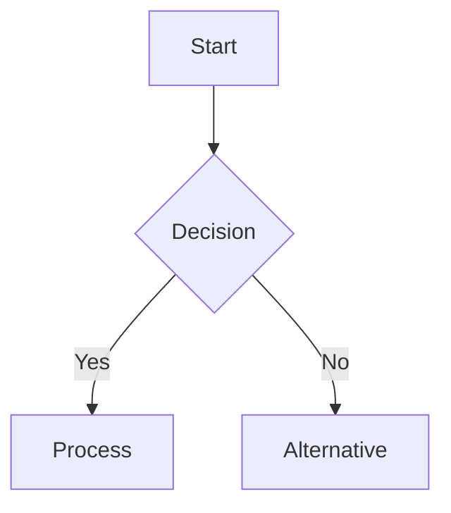
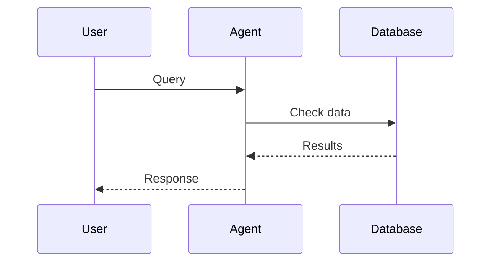
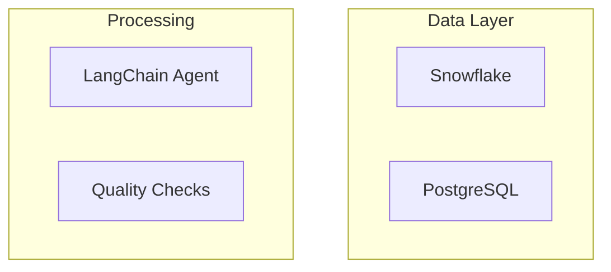
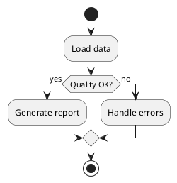

# Flow Diagrams Package

A comprehensive toolkit for creating flow diagrams and visualizations for data quality workflows using LangChain agents and Mermaid.js.

## Features

### 🤖 AI-Powered Diagram Generation
- **DiagramAgent**: LangChain agent that creates diagrams from natural language descriptions
- Supports multiple formats: Mermaid, PlantUML, Graphviz
- Intelligent diagram type selection based on description

### 📊 Pre-built Templates
- **MermaidGenerator**: Ready-to-use templates for common patterns
- Data quality workflow templates
- System architecture diagrams
- Agent interaction sequences
- Database schema visualizations

### 🎯 System Integration
- **WorkflowVisualizer**: Auto-generates diagrams from your actual system configuration
- Reads from `settings.yaml` to create accurate system diagrams
- Visualizes current database connections and schemas
- Documents real agent workflows and tool interactions

## Quick Start

```python
from src.flow_diagrams import DiagramAgent, MermaidGenerator, WorkflowVisualizer

# 1. AI-powered diagram creation
agent = DiagramAgent()
diagram = agent.create_diagram("User login process with 2FA authentication")

# 2. Template-based workflow
generator = MermaidGenerator()
dq_flow = generator.create_dq_workflow(
    data_sources=["Snowflake", "PostgreSQL"],
    quality_checks=["Duplicates", "Nulls", "Types"],
    outputs=["Report", "Dashboard"]
)

# 3. System visualization
visualizer = WorkflowVisualizer()
system_arch = visualizer.visualize_current_system_architecture()
```

## Available Diagram Types

### 🔄 Flowcharts (Mermaid)
Perfect for processes, workflows, and decision trees


### 📞 Sequence Diagrams (Mermaid)
Shows interactions between systems over time


### 🏗️ Architecture Diagrams (Mermaid)
System components and relationships


### 📋 UML Diagrams (PlantUML)
Formal process documentation


## Core Components

### DiagramAgent
AI-powered diagram generation using LangChain and OpenAI

**Features:**
- Natural language to diagram conversion
- Intelligent diagram type selection
- Multiple output formats
- Data quality workflow specialization

**Example:**
```python
agent = DiagramAgent()

# General diagram
result = agent.create_diagram("API authentication flow with JWT")

# DQ-specific diagram
dq_result = agent.create_dq_workflow_diagram(
    "Check customer data: duplicates, nulls, generate report"
)
```

### MermaidGenerator
Template-based Mermaid diagram creation

**Templates:**
- `create_dq_workflow()` - Data quality processes
- `create_agent_interaction_flow()` - AI agent sequences
- `create_system_architecture()` - Component diagrams
- `create_database_schema_flow()` - Database relationships

**Example:**
```python
generator = MermaidGenerator()

# Data quality workflow
workflow = generator.create_dq_workflow(
    data_sources=["Database A", "Database B"],
    quality_checks=["Duplicates", "Nulls", "Outliers"],
    outputs=["Report", "Alerts"],
    error_handling=True
)

# Save to file
generator.save_to_file(workflow, "dq_workflow", "./diagrams")
```

### WorkflowVisualizer
System-aware diagram generation from configuration

**Capabilities:**
- Reads actual system configuration
- Creates accurate architecture diagrams
- Visualizes real database connections
- Documents current workflows

**Methods:**
- `visualize_current_system_architecture()`
- `visualize_data_discovery_flow()`
- `visualize_agent_execution_flow()`
- `visualize_quality_check_workflow()`
- `create_complete_system_documentation()`

**Example:**
```python
visualizer = WorkflowVisualizer()

# Generate all system diagrams
saved_files = visualizer.create_complete_system_documentation("./diagrams")

# Individual diagrams
arch_diagram = visualizer.visualize_current_system_architecture()
discovery_flow = visualizer.visualize_data_discovery_flow()
```

## Usage Patterns

### 1. Quick Diagram Creation
```python
from src.flow_diagrams import DiagramAgent

agent = DiagramAgent()
result = agent.create_diagram("Your process description here")
print(result)
```

### 2. Template-Based Workflows
```python
from src.flow_diagrams import MermaidGenerator

generator = MermaidGenerator()
diagram = generator.create_dq_workflow(
    data_sources=["Source1", "Source2"],
    quality_checks=["Check1", "Check2"],
    outputs=["Output1", "Output2"]
)
```

### 3. System Documentation
```python
from src.flow_diagrams import WorkflowVisualizer

visualizer = WorkflowVisualizer()
docs = visualizer.create_complete_system_documentation()
```

### 4. Custom Integration
```python
# Combine multiple approaches
agent = DiagramAgent()
generator = MermaidGenerator()

# AI-generated base diagram
base = agent.create_diagram("Basic process flow")

# Template enhancement
enhanced = generator.create_dq_workflow(
    data_sources=["Extracted from base"],
    quality_checks=["From AI analysis"],
    outputs=["Combined approach"]
)
```

## Viewing Diagrams

### VS Code
1. Install "Mermaid Preview" extension
2. Open `.mmd` file
3. Use Ctrl+Shift+P → "Mermaid Preview"

### Online Viewer
Visit [mermaid.live](https://mermaid.live) and paste the code

### Convert to Images
```bash
# Install mermaid CLI
npm install -g @mermaid-js/mermaid-cli

# Convert to PNG
mmdc -i diagram.mmd -o diagram.png

# Convert to SVG
mmdc -i diagram.mmd -o diagram.svg
```

### Jupyter Notebooks
```python
from IPython.display import display, Markdown

display(Markdown(f"""
```mermaid
{diagram_code}
```
"""))
```

## File Structure
```
src/flow_diagrams/
├── __init__.py              # Package initialization
├── diagram_agent.py         # AI-powered diagram agent
├── mermaid_generator.py     # Template-based generator
├── workflow_visualizer.py   # System integration
├── examples.py             # Usage examples
└── README.md               # This documentation
```

## Dependencies
- `langchain-openai`: AI agent functionality
- `langchain`: Core agent framework
- `PyYAML`: Configuration file parsing
- `python-dotenv`: Environment variables

## Examples
See `examples.py` for comprehensive usage examples:
- Basic AI diagram generation
- Template-based workflows
- System visualization
- File saving and organization
- Interactive diagram creation

## Integration with Data Quality System

This package is specifically designed to work with the LLM Data Quality Agent system:

- **Visualizes actual agent workflows** from your configuration
- **Documents database connections** and schema relationships
- **Creates process diagrams** for quality checks and reporting
- **Generates system architecture** from real components

Perfect for documentation, onboarding, troubleshooting, and system analysis.
